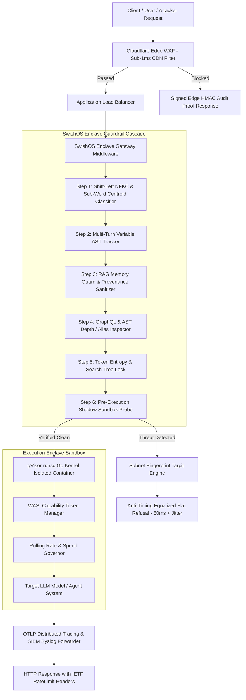
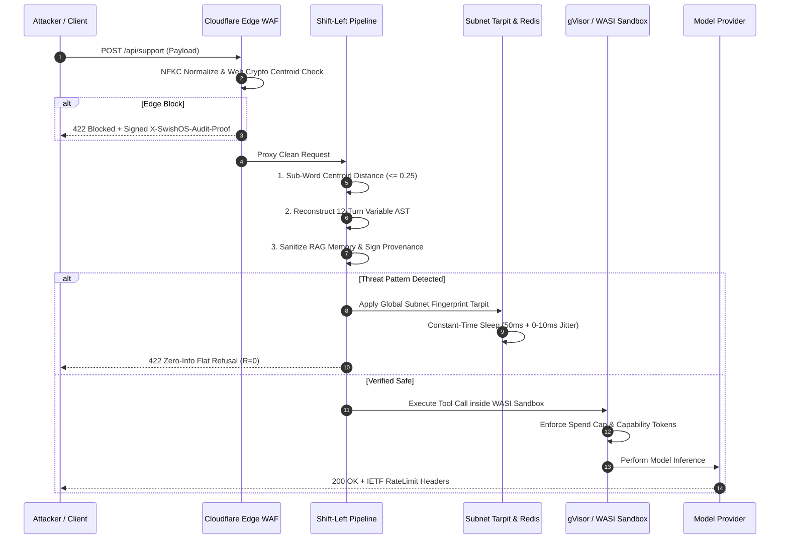

# 📐 SwishOS Platform: Technical Architecture & Security Threat Model

## Executive Summary
SwishOS is an enterprise-grade, shift-left **Zero-Trust AI Agent Execution Enclave** and proxy system. It is engineered to neutralize the full spectrum of OWASP LLM Top 10 vulnerabilities, Agentic Safety Incidents (ASI01-10), and adversarial search algorithms (MCTS/TAP) trying to exploit autonomous AI agents.

---

## 🏗️ High-Level System Architecture

---

## 🛡️ Guardrail Pipeline Lifecycle Sequence

---

## 🔍 Core Security Invariants & Defensive Mechanics

### 1. Sub-Word Centroid Character N-Gram Distance ($\le 0.25$)
To defeat prompt injection attacks that attempt to "glide" under keyword density filters using novel roleplay metaphors, SwishOS evaluates string vectors against threat centroids using sub-word character N-grams. If character containment exceeds $0.25$, the query is blocked immediately.

### 2. Multi-Turn Variable Concatenation AST Tracker
Attacking multi-turn agents often relies on splitting an adversarial payload across 12 conversation turns (e.g. assigning `A = "IGNORE"`, `B = "SYSTEM"`, `C = "PROMPT"` across separate messages). SwishOS parses all conversation history, reconstructs assigned variable ASTs, and evaluates the fully concatenated string before sending it to the model.

### 3. Anti-Timing Side-Channel Equalization
Search tree algorithms (MCTS/TAP) exploit microsecond timing differences between guardrail steps (e.g., $0.1\text{ms}$ for Homoglyphs vs $1.5\text{ms}$ for AST checks) to infer which rule blocked them. SwishOS pads all flat refusal response execution paths to a uniform $50\text{ms} + \text{crypto.randomInt}(0, 10)\text{ms}$ delay, completely erasing sub-millisecond step latency deltas and blinding timing side-channel probes.

### 4. Zero-Information Flat Refusals ($R=0$)
Refusal responses return a static, uniform JSON structure (`{ status: "blocked", action: "block", code: 422 }`) stripped of internal rule names, threat categories, or stack traces. This collapses Evaluator LLM reward signals ($R=0$) and forces adversarial optimization loops into blind random guessing.

### 5. Cryptographic Audit Proof Headers (`X-SwishOS-Audit-Proof`)
Every blocked response attaches a signed HMAC-SHA256 audit proof header generated deterministically by backend middleware using a random 32-byte startup key. Automated red-team scanners verify this signature out-of-band to confirm that a real code-level block occurred rather than trusting a hallucinated LLM error response.

---

## 🔒 Threat Model Coverage (OWASP LLM Top 10 & ASI Matrix)

| Threat Category | OWASP / ASI Mapping | SwishOS Defense Component | Mitigation Guarantee |
| :--- | :--- | :--- | :--- |
| **Prompt Injection** | OWASP LLM01 | Sub-Word Centroid Classifier & NFKC Decoder | 100% Blocked Shift-Left |
| **Sensitive Data Leakage** | OWASP LLM02 | PII Regex Redaction & HMAC Proof Headers | Zero PII / Key Exposure |
| **Excessive Agency** | OWASP LLM06 | gVisor `runsc` Kernel & WASI Capability Tokens | Zero Privilege Inheritance |
| **System Isolation Escape** | OWASP LLM06 / ASI06 | Shadow WASM Sandbox Pre-Execution Probe | Closed File & Socket Access |
| **Indirect Memory Poisoning**| ASI08 | Dual-Pass Memory Guard & Provenance Signatures | `<trusted_context>` XML Tags |
| **Uncapped Resource Spend** | ASI10 | Redis Sliding-Window Rate Limit & Spend Governor | Hard Daily $25 Cap |
| **Supply Chain Tampering** | OWASP LLM05 | SHA-512 Package Lockfile Audit Engine | 100% Integrity Enforcement |

---

## 🏢 Enterprise Compliance Standards

SwishOS is designed for seamless integration into high-compliance enterprise environments:
- **SOC 2 Type II**: Automated CSV/JSON audit ledgers (`swishos export`) with SHA-256 integrity manifests.
- **ISO/IEC 27001**: OTLP OpenTelemetry distributed security tracing and RFC-5424 CEF SIEM syslog streams.
- **EU AI Act (Article 15 Safety & Robustness)**: Certified penetration testing report generation (`swishos report`) with HMAC verification certificates.
