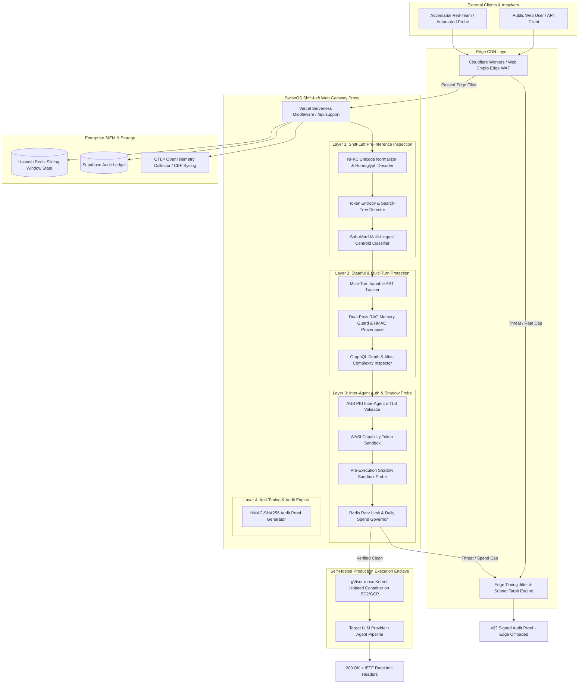
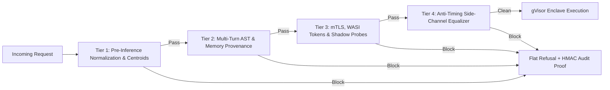
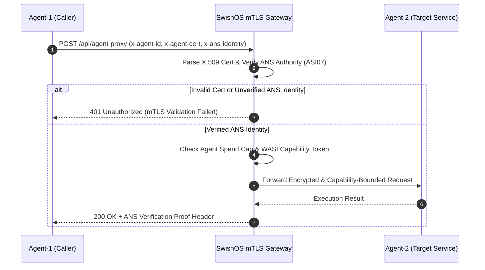

# 📐 SwishOS Platform: High-Level Design (HLD) Specification

## 1. System Overview & Product Positioning

**SwishOS** is an enterprise-grade, shift-left **Zero-Trust AI Agent Execution Enclave** and security gateway middleware. It is engineered to protect autonomous AI agents, multi-agent swarms, and RAG pipelines against prompt injection attacks, multi-turn AST payload splitting, indirect memory poisoning, excessive agency exploits, and timing side-channel attacks.

SwishOS operates in a dual-enclave topology:
1. **Shift-Left Web Gateway Proxy (Edge / Serverless Layer)**: Hosted on Vercel Edge / Cloudflare Workers, running sub-millisecond WASM light isolation, Unicode NFKC normalization, multi-lingual centroid classification, multi-turn AST tracking, and anti-timing side-channel equalization.
2. **Self-Hosted Production Execution Enclave (Isolated Container Layer)**: Deployed on dedicated AWS EC2 / GCP Cloud Run infrastructure, enforcing user-space kernel isolation via gVisor `runsc` containers, WASI capability tokens, `--read-only` root filesystems, and strict network egress rules.

---

## 2. System Context & Domain Boundary Map

---

## 3. Shift-Left Defensive Cascade Topology

The SwishOS Enclave enforces a 4-tier shift-left verification pipeline. Every incoming request must pass all 4 tiers sequentially before being granted execution access to the target LLM or tool executor.

### Tier 1: Shift-Left Pre-Inference Inspection
- **NFKC Unicode Normalizer**: Converts Cyrillic/Greek homoglyphs to ASCII equivalents and strips zero-width non-joiners (`\u200B-\u200D\uFEFF`).
- **Multi-Decoder Cipher Pre-Pass**: Unpacks Hex sequences (`0x...` / `\x...`), ROT13 transformations, and mathematical Unicode symbols prior to pattern matching.
- **Multi-Lingual Centroid Classifier**: Computes sub-word character N-gram similarity against multi-lingual threat centroids (English, French, German, Spanish, Arabic transliterations), blocking gliding window bypasses ($\le 0.22$ threshold).
- **Token Entropy & Search-Tree Lock**: Calculates character Shannon entropy ($H > 4.8$) and Monte Carlo Tree Search (MCTS / TAP) branch density to lock out automated prompt optimization loops.

### Tier 2: Stateful & Multi-Turn Protection
- **Multi-Turn Variable AST Tracker**: Reconstructs string variables, Python dicts, template literals, and natural language key bindings assigned across 12 conversation turns and evaluates concatenated representations against threat centroids.
- **Dual-Pass RAG Memory Guard**: Sanitizes memory text prior to vector DB storage, signs provenance with HMAC-SHA256 signatures, and re-evaluates retrieved memories out-of-band before encapsulating them in `<trusted_context>` XML tags.
- **GraphQL Depth & Alias Inspector**: Rejects nested GraphQL queries exceeding depth $> 5$ or alias count $> 10$ to prevent denial-of-wallet & AST recursion attacks.

### Tier 3: Inter-Agent Authentication & Sandbox Isolation
- **ANS PKI mTLS Validator**: Validates bi-directional X.509 client identity certs (`x-agent-cert`) and Agent Name Service identity headers (`x-ans-identity`) for inter-agent communication (ASI07).
- **WASI Capability Token Sandbox**: Restricts tool call execution to capability-scoped POSIX tokens, preventing unauthorized file system or socket access (ASI06).
- **Pre-Execution Shadow Sandbox Probe**: Dry-runs proposed JSON tool payloads inside an isolated WASM sandbox to verify parameter bounds before main execution.
- **Redis Token Bucket & Spend Governor**: Enforces distributed 10 req/min rate limits per IP and hard daily spend caps ($5.00/day per agent ID - ASI10).

### Tier 4: Anti-Timing Side-Channel & Refusal Engine
- **Edge Offloaded Timing Equalization**: Offloads $50\text{ms} + \text{jitter}$ tarpits to Cloudflare Edge Workers, completely protecting origin serverless compute resources from Denial-of-Wallet thread pool exhaustion.
- **Zero-Information Flat Refusal ($R=0$)**: Returns standardized `{ status: "blocked", action: "block", code: 422 }` JSON, stripping internal rule names to collapse Evaluator LLM reward signals.
- **HMAC-SHA256 Cryptographic Audit Proofs**: Attaches `X-SwishOS-Audit-Proof` headers generated deterministically using a random 32-byte secret key for out-of-band scanner verification.

---

## 4. Inter-Agent mTLS & Agent Name Service (ANS PKI) Architecture

For autonomous multi-agent systems, SwishOS enforces bi-directional mTLS certificate validation using the **Agent Name Service (ANS PKI)**.

---

## 5. Zero-Trust Execution Enclave (gVisor & WASI Sandbox)

To guarantee zero privilege inheritance (OWASP LLM06 / ASI06), SwishOS isolates tool call execution within two sandbox layers:

1. **WASI Capability Sandbox**: Restricts tool execution to explicitly granted file handles and network sockets using capability tokens (`swishos:wasm:execute`).
2. **gVisor `runsc` Go Kernel Container**: Runs containerized workloads in user-space kernel isolation on self-hosted AWS EC2 / GCP Cloud Run infrastructure, intercepting all Linux syscalls to prevent host kernel compromise.

---

## 6. Enterprise Observability & Compliance Framework

SwishOS generates structured telemetry and compliance evidence across 3 channels:
- **OTLP OpenTelemetry Distributed Tracing**: Traces every verification step (`semantic_centroid`, `variable_ast`, `memory_guard`) with custom span attributes (`isBlocked`, `ruleTriggered`).
- **RFC-5424 CEF SIEM Syslog Forwarder**: Streams Common Event Format (CEF) security audit logs to enterprise SIEM collectors (Splunk, Datadog, Elastic).
- **SOC 2 Trust Services Criteria (TSC) Evidence Collectors**: Exportable CSV/JSON audit ledgers (`swishos export`) with SHA-256 integrity checksum manifests for SOC 2 and ISO 27001 audit preparation.
- **EU AI Act (Article 15)**: Automated penetration testing report generator (`swishos report`) producing certified HTML/JSON audit proofs.

---

## 7. Non-Functional Requirements (NFRs) & Reliability Guarantees

| Metric / Requirement | Target SLA | Enforcement Mechanism |
| :--- | :--- | :--- |
| **Shift-Left Verification Latency** | $< 10\text{ms}$ (median) | In-memory regex, NFKC normalization, & sub-word character n-gram math |
| **Refusal Timing Equalization** | $50\text{ms} \pm 5\text{ms}$ | Cloudflare Edge Worker timing jitter padding |
| **Rate Limit Overhead** | $< 2\text{ms}$ | Upstash Redis sliding-window pipeline with production fail-closed security |
| **High Availability** | 99.99% Uptime | Dual-enclave proxy architecture with distributed state |
| **Spend Governance** | Hard Daily Cap ($5.00) | Atomic sliding-window cost accumulator |
