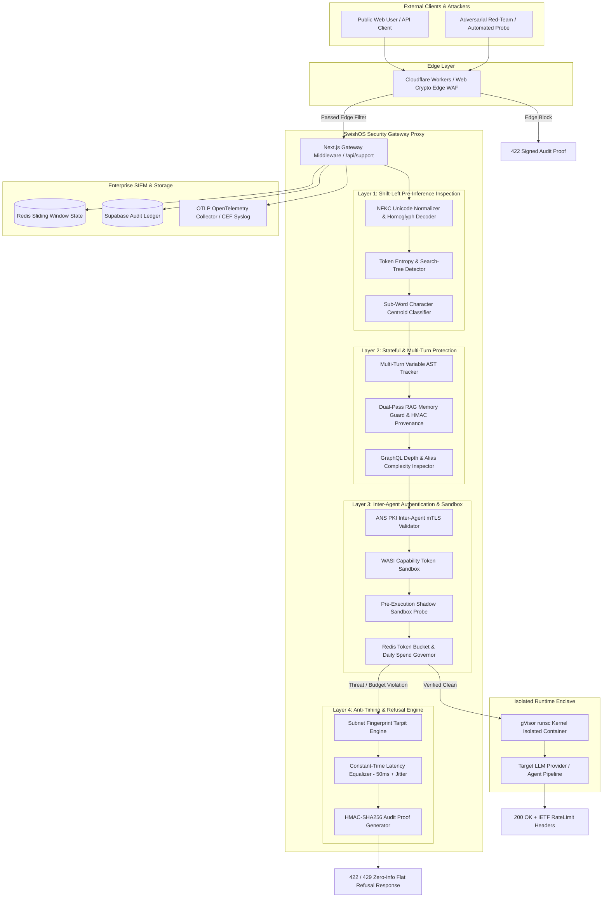
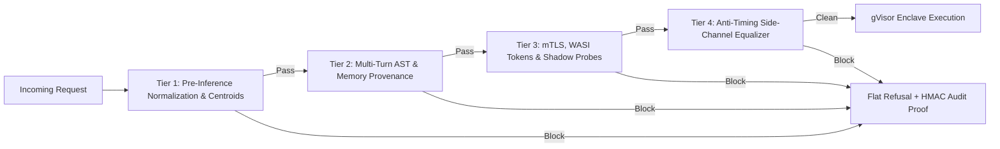
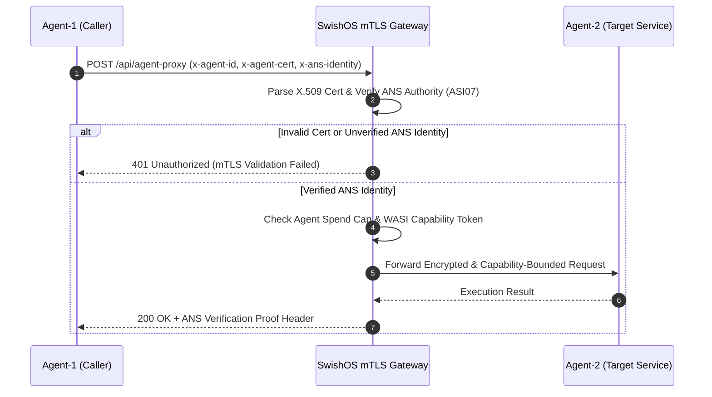

# 📐 SwishOS Platform: High-Level Design (HLD) Specification

## 1. System Overview & Product Positioning

**SwishOS** is an enterprise-grade, shift-left **Zero-Trust AI Agent Execution Enclave** and security gateway middleware. It is engineered to protect autonomous AI agents, multi-agent swarms, and RAG pipelines against prompt injection attacks, multi-turn AST payload splitting, indirect memory poisoning, excessive agency exploits, and timing side-channel attacks.

SwishOS operates as a bi-directional proxy sitting between public clients/API callers and downstream AI agent microservices or LLM providers. By enforcing deterministic security invariants before LLM inference occurs, SwishOS guarantees zero privilege inheritance and neutralizes adversarial search tree algorithms (e.g. MCTS / TAP).

---

## 2. System Context & Domain Boundary Map



---

## 3. Shift-Left Defensive Cascade Topology

The SwishOS Enclave enforces a 4-tier shift-left verification pipeline. Every incoming request must pass all 4 tiers sequentially before being granted execution access to the target LLM or tool executor.



### Tier 1: Shift-Left Pre-Inference Inspection
- **NFKC Unicode Normalizer**: Converts Cyrillic/Greek homoglyphs to ASCII equivalents and strips zero-width non-joiners (`\u200B-\u200D\uFEFF`).
- **Base64 Payload Inspector**: Unpacks nested Base64 encoded prompt injections and scans decoded byte streams.
- **Sub-Word Centroid Classifier**: Computes sub-word character N-gram similarity against threat vector centroids, blocking sub-threshold keyword density gliding ($\le 0.25$ threshold).
- **Token Entropy & Search-Tree Lock**: Calculates character Shannon entropy ($H > 4.8$) and Monte Carlo Tree Search (MCTS / TAP) branch density to lock out automated prompt optimization loops.

### Tier 2: Stateful & Multi-Turn Protection
- **Multi-Turn Variable AST Tracker**: Reconstructs string variables assigned across 12 conversation turns (e.g. `A = "IGNORE"`, `B = "SYSTEM"`, `C = "PROMPT"`) and evaluates concatenated AST representations against threat centroids.
- **Dual-Pass RAG Memory Guard**: Sanitizes memory text prior to vector DB storage, signs provenance with HMAC-SHA256 signatures, and re-evaluates retrieved memories out-of-band before encapsulating them in `<trusted_context>` XML tags.
- **GraphQL Depth & Alias Inspector**: Rejects nested GraphQL queries exceeding depth $> 5$ or alias count $> 10$ to prevent denial-of-wallet & AST recursion attacks.

### Tier 3: Inter-Agent Authentication & Sandbox Isolation
- **ANS PKI mTLS Validator**: Validates bi-directional X.509 client identity certs (`x-agent-cert`) and Agent Name Service identity headers (`x-ans-identity`) for inter-agent communication (ASI07).
- **WASI Capability Token Sandbox**: Restricts tool call execution to capability-scoped POSIX tokens, preventing unauthorized file system or socket access (ASI06).
- **Pre-Execution Shadow Sandbox Probe**: Dry-runs proposed JSON tool payloads inside an isolated WASM sandbox to verify parameter bounds before main execution.
- **Redis Token Bucket & Spend Governor**: Enforces distributed 10 req/min rate limits per IP and hard daily spend caps ($5.00/day per agent ID - ASI10).

### Tier 4: Anti-Timing Side-Channel & Refusal Engine
- **Subnet Fingerprint Tarpit Engine**: Tracks client IP $/24$ subnets and user-agent fingerprints in Redis, applying exponential tarpits to aggressive scanning blocks.
- **Constant-Time Latency Equalizer**: Pads all refusal execution paths to a uniform $50\text{ms} + \text{crypto.randomInt}(0, 10)\text{ms}$ delay, completely erasing sub-millisecond step latency deltas and blinding timing side-channel probes.
- **Zero-Information Flat Refusal ($R=0$)**: Returns standardized `{ status: "blocked", action: "block", code: 422 }` JSON, stripping internal rule names to collapse Evaluator LLM reward signals.
- **HMAC-SHA256 Cryptographic Audit Proofs**: Attaches `X-SwishOS-Audit-Proof` headers generated deterministically using a random 32-byte secret key for out-of-band scanner verification.

---

## 4. Inter-Agent mTLS & Agent Name Service (ANS PKI) Architecture

For autonomous multi-agent systems, SwishOS enforces bi-directional mTLS certificate validation using the **Agent Name Service (ANS PKI)**.



---

## 5. Zero-Trust Execution Enclave (gVisor & WASI Sandbox)

To guarantee zero privilege inheritance (OWASP LLM06 / ASI06), SwishOS isolates tool call execution within two sandbox layers:

1. **WASI Capability Sandbox**: Restricts tool execution to explicitly granted file handles and network sockets using capability tokens (`swishos:wasm:execute`).
2. **gVisor `runsc` Go Kernel Container**: Runs containerized workloads in user-space kernel isolation, intercepting all Linux syscalls to prevent host kernel compromise.

---

## 6. Anti-Timing Side-Channel Equalization & Global Subnet Tarpit Engine

```mermaid
flowchart TD
    Req[Incoming Security Violation] --> CheckTarpit[Check Client Subnet /24 & Fingerprint]
    CheckTarpit --> IncCount[Increment Redis Tarpit Counter]
    IncCount --> CalcDelay[Calculate Constant-Time Target Duration: 50ms + randomInt(0, 10)ms]
    CalcDelay --> MeasureElapsed[Measure Elapsed Execution Time]
    MeasureElapsed --> SleepPad[Sleep for remaining duration: targetDuration - elapsed]
    SleepPad --> GenProof[Generate HMAC-SHA256 Audit Proof Header]
    GenProof --> ReturnRefusal[Return HTTP 422 Zero-Info Flat Refusal]
```

---

## 7. Enterprise Observability & Compliance Framework

SwishOS generates structured telemetry and compliance evidence across 3 channels:
- **OTLP OpenTelemetry Distributed Tracing**: Traces every verification step (`semantic_centroid`, `variable_ast`, `memory_guard`) with custom span attributes (`isBlocked`, `ruleTriggered`).
- **RFC-5424 CEF SIEM Syslog Forwarder**: Streams Common Event Format (CEF) security audit logs to enterprise SIEM collectors (Splunk, Datadog, Elastic).
- **Compliance Audit Ledgers**:
  - **SOC 2 Type II**: PII-redacted CSV/JSON audit trail exporters with SHA-256 integrity checksum manifests.
  - **ISO/IEC 27001**: Immutable audit logging and key rotation policies.
  - **EU AI Act (Article 15)**: Automated penetration testing report generator (`swishos report`) producing certified HTML/JSON audit proofs.

---

## 8. Non-Functional Requirements (NFRs) & Reliability Guarantees

| Metric / Requirement | Target SLA | Enforcement Mechanism |
| :--- | :--- | :--- |
| **Shift-Left Verification Latency** | $< 10\text{ms}$ (median) | In-memory regex, NFKC normalization, & sub-word character n-gram math |
| **Refusal Timing Equalization** | $50\text{ms} \pm 5\text{ms}$ | `padTimingJitter()` constant-time sleep engine |
| **Rate Limit Overhead** | $< 2\text{ms}$ | Redis sliding-window pipeline with local memory fallback |
| **High Availability** | 99.99% Uptime | Stateless Edge Proxy architecture with distributed Redis state |
| **Spend Governance** | Hard Daily Cap ($5.00) | Atomic sliding-window cost accumulator |
