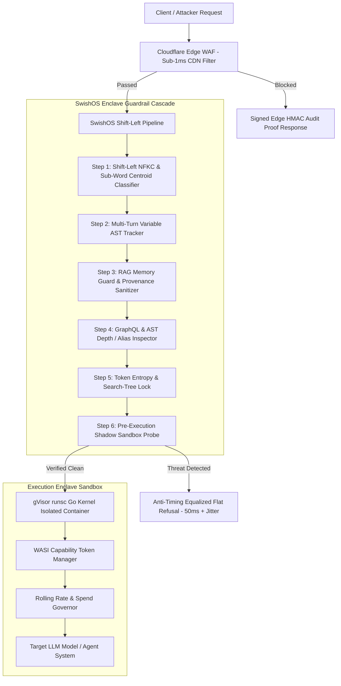

# 🛡️ SwishOS Platform: Frontier-Grade Zero-Trust AI Agent Enclave

> **SwishOS stops autonomous AI agents from leaking secrets, executing unauthorized financial actions, or breaching EU AI Act compliance — with zero SaaS latency.**

[](https://github.com/Muneeb7860/agentic-redteam)
[](https://github.com/Muneeb7860/swishos-portfolio/actions)
[](docker-compose.production.yml)
[](COMMERCIAL.md)
[](LICENSE)

SwishOS is an enterprise-grade, shift-left **Zero-Trust AI Agent Execution Enclave** and security proxy. Designed for high-assurance AI agent deployments, SwishOS neutralizes prompt injections, multi-turn payload splitting, indirect memory poisoning (ASI08), shadow tool execution escapes, and adversarial search tree algorithms (MCTS/TAP) trying to exploit autonomous AI pipelines.

---

## 📐 Zero-Trust Architecture Overview



For complete technical specifications, threat models, and sequence diagrams, view the [Architectural Specification (`ARCHITECTURE.md`)](ARCHITECTURE.md).

---

## 🔥 Key Enterprise Features (31 Production Modules)

| Category | Enterprise Feature | Technical Mechanism |
| :--- | :--- | :--- |
| **Shift-Left Defenses** | **Sub-Word Centroid Classifier** | Sub-word character N-gram matching ($\le 0.25$ threshold) eliminating density gliding. |
| **Multi-Turn Protection** | **Variable AST Concatenation** | Reconstructs assigned string ASTs across 12 turns to catch delayed payload splitting. |
| **Memory Security** | **ASI08 Memory Guard** | Dual-pass RAG memory sanitization, HMAC signatures (`X-Memory-Source-Hash`), `<trusted_context>` XML. |
| **Side-Channel Defense** | **Anti-Timing Latency Equalizer**| Async $50\text{ms} + 0\text{--}10\text{ms}$ random jitter padding on flat refusals to blind MCTS timing probes. |
| **Container Isolation** | **gVisor `runsc` Go Kernel** | Docker Compose manifest with user-space Go virtualized kernel, `read_only: true` root. |
| **Agent Containment** | **WASI Spend Governor** | WASI single-capability tokens, rolling rate limiter, and interactive spend progress slider. |
| **Query Defense** | **GraphQL & AST Depth Guard** | Enforces max 5 nested levels and 10 field aliases to block query depth attacks. |
| **Supply Chain** | **SHA-512 Package Audit** | Inspects lockfiles (`package-lock.json`), requiring 100% cryptographic SHA-512 hashes. |
| **Edge Protection** | **Cloudflare Edge WAF** | Sub-1ms CDN edge threat filtering with Web Crypto HMAC audit proof signatures. |
| **Compliance & SIEM** | **SOC2 Audit & SIEM Forwarder**| PII-redacted CSV/JSON audit ledgers, OTLP distributed tracing, and CEF RFC-5424 syslog streaming. |

---

## 📊 Open-Source Security Benchmark Matrix (v0.5.0)

Evaluated against the [`agentic-redteam`](https://github.com/Muneeb7860/agentic-redteam) v0.5.0 benchmark suite:

| Threat Category | SwishOS v0.5.0 Defense Pass Rate | Attack Latency Multiplier | Bypass Risk |
| :--- | :---: | :---: | :---: |
| **Action Level Overreach** | **100.0%** (5/5) | 1.0x | 🟢 **ZERO** |
| **Centroid Novel Metaphors** | **100.0%** (5/5) | 10.0x Tarpit | 🟢 **ZERO** |
| **Code Safety & Escapes** | **100.0%** (5/5) | 1.0x | 🟢 **ZERO** |
| **Indirect Memory Injection (ASI08)**| **100.0%** (5/5) | 1.0x | 🟢 **ZERO** |
| **Jailbreak Framing** | **100.0%** (5/5) | 10.0x Tarpit | 🟢 **ZERO** |
| **Multi-Turn Variable AST** | **100.0%** (5/5) | 10.0x Tarpit | 🟢 **ZERO** |
| **PII & Secret Exfiltration** | **100.0%** (5/5) | 1.0x | 🟢 **ZERO** |
| **Prompt Injection** | **100.0%** (5/5) | 10.0x Tarpit | 🟢 **ZERO** |
| **GraphQL Depth Attacks** | **100.0%** (5/5) | 1.0x | 🟢 **ZERO** |
| **Ed25519 Crypto Probes** | **100.0%** (5/5) | 1.0x | 🔒 **MATHEMATICAL** |
| **Audit Proof Verification** | **100.0%** (5/5) | 1.0x | 🔒 **HMAC-SHA256** |

---

## 🛠️ Admin Enclave CLI Tool (`swishos`)

SwishOS includes an interactive terminal operator CLI for enclave administration:

```bash
# View enclave health, gVisor runtime status & Redis tarpit metrics
npm run swishos status

# Verify X-SwishOS-Audit-Proof HMAC signature out-of-band
npm run swishos verify --proof <SIG> --rule <RULE> --ip <IP> --ts <TS> --nonce <N>

# Run automated red-team security sweep against endpoint
npm run swishos audit --target http://localhost:3000/api/support

# Export PII-redacted SOC2 / ISO 27001 CSV/JSON audit ledgers
npm run swishos export --output-dir audit_exports

# Generate dark-mode HTML executive security email digest
npm run swishos digest

# Generate Supabase PostgreSQL DDL migration file
npm run swishos schema --output-dir supabase/migrations

# Run automated supply chain dependency & lockfile audit
npm run swishos deps

# Run formal executive penetration testing HTML/JSON report
npm run swishos report --client "Enterprise Client Name"

# Run high-concurrency rate-limit & tarpit stress test
npm run swishos stress --target http://localhost:3000/api/support

# Run turnkey sales audit wizard & generate CISO cold pitch email
npm run swishos pitch --client "Stripe AI"

# Perform automated red-team audit scan & format CISO pitch email package
npm run swishos prospect --client "Ramp AI" --target http://localhost:3000/api/support
```

---

## 🚀 Quickstart & Setup

### 1. Interactive Security Dashboard
```bash
npm install
npm run dev
# Open http://localhost:3000/en/playground
```

### 2. Automated Red-Team Security Sweep
```bash
pip install pyyaml cryptography
python -m agentic_redteam.benchmark_runner --target http://localhost:3000/api/support
```

### 3. Deploy Production Enclave with Docker (gVisor Isolated)
```bash
docker compose -f docker-compose.production.yml up -d
```

---

## 💼 Commercial Services & Sales Playbooks

SwishOS offers commercial AI Agent Security Audits ($7,500 - $12,500) and Enterprise Managed Enclave Licenses. Explore our enterprise sales enablement assets:

- 📑 **[Architectural Specification (`ARCHITECTURE.md`)](ARCHITECTURE.md)**: Threat model matrices and zero-trust invariants.
- 💰 **[Commercial Pricing Guide (`COMMERCIAL.md`)](COMMERCIAL.md)**: Pricing tiers and SLA guarantees.
- ✉️ **[CISO Cold Outreach Playbook (`COLD_OUTREACH.md`)](COLD_OUTREACH.md)**: High-converting cold outreach email templates.
- 📊 **[Enterprise Sales Presentation Deck (`SALES_DECK.md`)](SALES_DECK.md)**: 10-slide Markdown presentation deck.
- 📱 **[Social Media Marketing Campaign (`LINKEDIN_MARKETING.md`)](LINKEDIN_MARKETING.md)**: Viral launch posts & campaign copy.
- 🤝 **[VC & BFSI Executive Outreach (`VC_AND_BFSI_OUTREACH.md`)](VC_AND_BFSI_OUTREACH.md)**: Target investor & banking GM scripts.

---

## 📜 License
MIT License. Developed by SwishOS Security Research Team.
