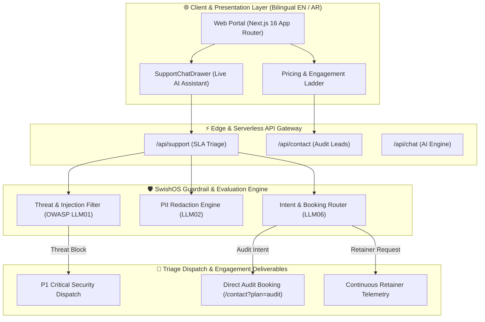

# SwishOS — AI Agent Security & Governance Platform

[](https://nextjs.org/)
[](https://www.typescriptlang.org/)
[](https://owasp.org/www-project-top-10-for-large-language-model-applications/)
[%20Compliant-brightgreen?logo=owasp)](https://swishos.io)
[](https://swishos.io)
[](LICENSE)

Official enterprise web portal, live interactive client platform, and engagement catalog for **SwishOS** ([`swishos.io`](https://swishos.io)). 

SwishOS delivers continuous **AI Agent Security, Red-Teaming, Guardrail Assurance, and OWASP LLM Top 10 Compliance** for teams deploying autonomous LLM agents to production.

---

## 🌟 Ecosystem Overview & GitHub Repositories

| Repository / Module | Focus & Purpose | Status |
| :--- | :--- | :--- |
| **[`swishos-portfolio`](https://github.com/Muneeb7860/swishos-portfolio)** | Official bilingual web platform, pricing ladder, ROI calculator & live support triage assistant. | 🟢 Production (`main`) |
| **[`agentic-redteam`](https://github.com/Muneeb7860/agentic-redteam)** | Standalone open-source HTTP red-team harness for testing prompt injections, DAN, and PII exfiltration. | 🟡 Active Development |
| **`homelab-ai-governance`** | Evaluation benchmarks, SQL AST guardrail detectors, and OWASP LLM 2026 crosswalk evaluators. | 🟢 Internal Suite |

---

## 🚀 Key Features & Capabilities

### 🛡️ 1. AI Agent Security & OWASP LLM Top 10 Governance
- **Red-Team Diagnostic Engine:** Mapped against prompt injection, jailbreaks, tool abuse, PII exfiltration, and non-deterministic safety drift.
- **Guardrail Integration:** Samples ready-to-merge configs for NeMo Guardrails, Llama-Guard, and custom AST validators.

### 💰 2. Productized Service Engagement Ladder
- **Tier 1 — `agentic-redteam` (Free & Open Source):** Self-serve HTTP test harness under Apache 2.0.
- **Tier 2 — AI Agent Security Audit ($7,500 – $12,500):** Fixed 1–2 week engagement delivered directly to evaluate production agents touching money, customer PII, or internal DBs.
- **Tier 3 — Continuous Security Retainer ($4,500 / month):** Rolling month-to-month assurance, regression telemetry, and threat sweeps on every release.

### 🤖 3. Live AI Triage Assistant & Omni-Channel Support
- **Embedded AI Security Assistant:** Floating live chat widget ([`SupportChatDrawer.tsx`](file:///Users/muneeb/Documents/GitHub/portfolio/src/components/SupportChatDrawer.tsx)) supporting natural conversation in English & Arabic.
- **Contextual Intent Routing:** Automatically detects audit booking requests and renders direct pre-filled booking actions (`/contact?plan=audit`).
- **Real-Time SLA Triage:** Classifies security incidents (P1 - 15m SLA), technical bugs (P2 - 1h SLA), and general inquiries.

### 🌐 4. Native Bilingual & RTL Support (`/en` & `/ar`)
- Complete English and Arabic localization driven by serverless dictionary engines ([`en.json`](file:///Users/muneeb/Documents/GitHub/portfolio/src/dictionaries/en.json) & [`ar.json`](file:///Users/muneeb/Documents/GitHub/portfolio/src/dictionaries/ar.json)).
- Native CSS logical properties (`insetInlineEnd`, `marginInline`) and `dir="rtl"` layout handling.

### 📊 5. OWASP LLM 2026 Framework Security Benchmark
| Framework | Tool Execution Safety | Indirect Prompt Protection | PII Leakage Resilience | Recommended Protection |
| :--- | :--- | :--- | :--- | :--- |
| **LangChain Agents** | ⚠️ Moderate | ⚠️ Low (Requires custom callbacks) | ⚠️ Moderate | `agentic-redteam` + Custom AST Guardrails |
| **AutoGen Multi-Agent** | ❌ Vulnerable | ⚠️ Low (Agent-to-agent drift) | ⚠️ Moderate | SwishOS Fixed Audit & Retainer |
| **CrewAI Workflows** | ⚠️ Moderate | ⚠️ Low (Delegation injection) | ❌ High Vulnerability | NeMo / SwishOS Guardrail Layer |
| **LLaMA-Index RAG** | ✅ Strong (Data) | ⚠️ Moderate (Context poisoning) | ✅ Strong | `agentic-redteam` Automated CI Suite |
| **SwishOS Governed Agent** | 🛡️ Protected | 🛡️ Protected (Shift-Left Block) | 🛡️ Redacted | Native Guardrail Architecture |

### 📈 6. Interactive ROI & Savings Calculator
- Dynamic cost and time savings calculator (`/[lang]/roi`) demonstrating time saved by AI security automation and projected annual ROI.

## 📐 Architecture & Flow Diagram



---

## 🛠️ Tech Stack & Architecture

- **Core Framework:** Next.js 16 (App Router with Turbopack)
- **Language:** TypeScript 5.0 (Strict mode enabled)
- **Styling System:** Vanilla CSS Tokens + Custom HSL Design Tokens (Zero heavy CSS utility runtime overhead)
- **Icons & Motion:** Lucide React, Framer Motion
- **Localization:** Custom App Router i18n Dictionary Engine (`[lang]` routing)
- **Hosting & Infrastructure:** Vercel Edge & Serverless Platform

---

## 📁 Repository Structure

```
swishos-portfolio/
├── src/
│   ├── app/
│   │   ├── api/
│   │   │   ├── chat/route.ts          # Serverless AI Agent Endpoint
│   │   │   ├── contact/route.ts       # Contact & Audit Lead Capture
│   │   │   └── support/route.ts       # Live Support & SLA Triage Route
│   │   └── [lang]/
│   │       ├── page.tsx               # Flagship Platform Landing Page
│   │       ├── features/page.tsx      # Security Features & OWASP Matrix
│   │       ├── pricing/page.tsx       # Engagement Ladder & Pricing FAQs
│   │       ├── roi/page.tsx           # Interactive ROI & Savings Calculator
│   │       ├── vision/page.tsx        # SwishOS Security Mission
│   │       ├── support/page.tsx       # Live Support Hub & Telemetry Stream
│   │       ├── contact/page.tsx       # Audit Booking & Lead Contact Form
│   │       ├── login/page.tsx         # Security Console Client Sign-In
│   │       └── signup/page.tsx        # Enterprise Early Access Registration
│   ├── components/                    # SupportChatDrawer, LanguageSwitcher, ThemeToggle
│   ├── dictionaries/                  # en.json & ar.json localized strings
│   └── hooks/                         # useScrollReveal & interactive hooks
├── public/                            # SwishOS Brand Assets & Logos
├── vercel.json                        # Vercel Deployment Configuration
└── next.config.ts                     # Next.js Build Configuration
```

---

## ⚙️ Local Development & Setup

### Prerequisites
- Node.js `18.x` or later
- npm or pnpm

### 1. Clone & Install
```bash
git clone https://github.com/Muneeb7860/swishos-portfolio.git
cd swishos-portfolio
npm install
```

### 2. Run Development Server
```bash
npm run dev
```
Open [http://localhost:3000](http://localhost:3000) to view the application locally.

### 3. Verify Production Build & Types
```bash
npx tsc --noEmit
npm run build
```

---

## 🔒 Security & OWASP LLM 2026 Standards

SwishOS incorporates shift-left guardrails directly into its API endpoints:
- **Prompt Injection Defense:** Regex and heuristic threat filtering against DAN, developer overrides, system prompt exfiltration, and SQL injection.
- **PII Redaction Engine:** Automatic regex sanitization for emails, credit cards, SSNs, IP addresses, and API keys prior to storage or triage dispatch.

---

## 📜 License & Author

© 2026 **SwishOS**. Built by a principal security architect specializing in autonomous agent governance and LLM guardrails.

Licensed under the [Apache-2.0 License](LICENSE).
