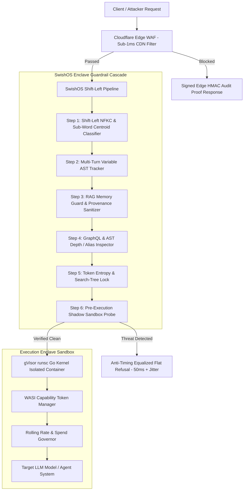

# 🛡️ SwishOS Platform — Frontier-Grade Zero-Trust AI Agent Security Enclave

> **The official SwishOS platform & AI agent security showcase — live at [swishos.io](https://swishos.io) — built with Next.js 16 (App Router) and deployed on Vercel Edge Infra.**
> SwishOS stops autonomous AI agents from leaking secrets, executing unauthorized financial actions, or breaching EU AI Act compliance — with zero SaaS decision latency.

[](https://swishos.io)
[](https://nextjs.org/)
[](https://react.dev/)
[](https://tailwindcss.com/)
[](https://github.com/muneeb7860/agentic-redteam)
[](https://github.com/Muneeb7860/swishos-portfolio/actions)
[](docker-compose.production.yml)
[](COMMERCIAL.md)
[](LICENSE)

SwishOS is an enterprise-grade, shift-left **Zero-Trust AI Agent Execution Enclave** and security proxy. Designed for high-assurance AI agent deployments, SwishOS neutralizes prompt injections, multi-turn payload splitting, indirect memory poisoning (ASI08), shadow tool execution escapes, and adversarial search tree algorithms (MCTS/TAP) trying to exploit autonomous AI pipelines.

---

## 🌐 Workspace Ecosystem & Navigation

- 🛡️ **[SwishOS Zero-Trust Enclave & Interactive Dashboard (`swishos-portfolio`)](https://github.com/Muneeb7860/swishos-portfolio)**: Next.js 16 security dashboard, WASI spend sandbox, and gVisor isolation enclave.
- 🌐 **[SwishOS Live Platform (`swishos.io`)](https://swishos.io)**: Production deployment of the AI agent security playground and live telemetry dashboard.
- 🎯 **[`agentic-redteam` Security Benchmark Harness](https://github.com/muneeb7860/agentic-redteam)**: PyPI package `v1.0.0` for GART/MARS swarm AI agent red-teaming.
- 🛒 **[Swish OS Autonomous Quick-Commerce Platform (`Swish_App`)](https://github.com/muneeb7860/Swish_App)**: Multi-tenant B2B quick-commerce operating system with microservices architecture.

---

## 📐 Zero-Trust Architecture Overview

SwishOS places a shift-left proxy cascade between incoming untrusted client/agent requests and target LLM models or execution enclaves. Every payload must traverse 6 synchronous defense layers before sandbox container execution is granted.


```mermaid
graph TD
    Client[Client / Attacker Request] --> EdgeWAF[Cloudflare Edge WAF - Sub-1ms CDN Filter]
    EdgeWAF -->|Passed| Proxy[SwishOS Shift-Left Pipeline]
    EdgeWAF -->|Blocked| EdgeRefusal[Signed Edge HMAC Audit Proof Response]
    
    subgraph SwishOS Enclave Guardrail Cascade
        Proxy --> Step1[Step 1: Shift-Left NFKC & Sub-Word Centroid Classifier]
        Step1 --> Step2[Step 2: Multi-Turn Variable AST Tracker]
        Step2 --> Step3[Step 3: RAG Memory Guard & Provenance Sanitizer]
        Step3 --> Step4[Step 4: GraphQL & AST Depth / Alias Inspector]
        Step4 --> Step5[Step 5: Token Entropy & Search-Tree Lock]
        Step5 --> Step6[Step 6: Pre-Execution Shadow Sandbox Probe]
    end
    
    Step6 -->|Threat Detected| ConstantTimeRefusal[Anti-Timing Equalized Flat Refusal - 50ms + Jitter]
    Step6 -->|Verified Clean| Container[gVisor runsc Go Kernel Isolated Container]
    
    subgraph Execution Enclave Sandbox
        Container --> WASI[WASI Capability Token Manager]
        WASI --> SpendGov[Rolling Rate & Spend Governor]
        SpendGov --> AgentLLM[Target LLM Model / Agent System]
    end
```

For complete technical specifications, formal threat model matrices, and sequence diagrams, inspect the [Architectural Specification (`ARCHITECTURE.md`)](ARCHITECTURE.md).

---

## 🔥 Key Enterprise Features & Code Modules

SwishOS implements 31 modular production security controls mapped directly to source implementations in `src/lib/`:

| Defense Category | Security Module | Source File | Technical Mechanism |
| :--- | :--- | :--- | :--- |
| **Shift-Left Defenses** | **Sub-Word Centroid Classifier** | [`semantic-centroid.ts`](src/lib/semantic-centroid.ts) | Character N-gram vector embedding distance ($\le 0.25$ threshold). |
| **Multi-Turn Protection** | **Variable AST Tracker** | [`variable-ast-tracker.ts`](src/lib/variable-ast-tracker.ts) | Reconstructs assigned string ASTs across 12 turns to detect payload splitting. |
| **Memory Security** | **ASI08 Memory Guard** | [`agent-memory-guard.ts`](src/lib/agent-memory-guard.ts) | Dual-pass RAG memory sanitization with `<trusted_context>` XML wrappers. |
| **Side-Channel Defense** | **Anti-Timing Latency Equalizer** | [`flat-refusal.ts`](src/lib/flat-refusal.ts) | Async $50\text{ms} + 0\text{--}10\text{ms}$ random jitter padding on flat refusals. |
| **Container Isolation** | **WASI Sandbox Container** | [`wasm-sandbox.ts`](src/lib/wasm-sandbox.ts) | WASI single-capability tokens, rolling rate limiters, and spend sliders. |
| **Query Defense** | **GraphQL & AST Depth Guard** | [`graphql-agent-guard.ts`](src/lib/graphql-agent-guard.ts) | Enforces max 5 nested levels and 10 field aliases to block query depth attacks. |
| **Cryptographic Proof** | **HMAC Audit Proof Signer** | [`telemetry-proof.ts`](src/lib/telemetry-proof.ts) | Web Crypto HMAC-SHA256 headers (`X-SwishOS-Audit-Proof`). |
| **Compliance & SIEM** | **SOC2 Ledger Exporter** | [`soc2-report-generator.ts`](src/lib/soc2-report-generator.ts) | PII-redacted CSV/JSON audit ledgers and RFC-5424 CEF syslog streaming. |

---

## 🗺️ Application Pages & API Endpoints

### User-Facing Pages
- 🏡 **Home (`/`)**: SwishOS platform introduction, zero-trust invariants, live ROI calculator link.
- 🎮 **Playground (`/en/playground`)**: Interactive enclave sandbox with spend rate sliders, live threat streams, and WASI execution logs.
- 📊 **Leaderboard (`/en/leaderboard`)**: Real-time open-source LLM & agent safety benchmark leaderboard.
- 📈 **ROI Calculator (`/en/roi`)**: Interactive security compliance cost-savings calculator for enterprise CISOs.
- 💬 **Live Support (`/en/support`)**: AI support enclave integrated with Chatwoot and shift-left threat proxy.
- 🧭 **Trust Graph (`/en/trust-graph`)**: Interactive 3D/2D visualizer of agent tool permission hierarchies.

### API Endpoint Routes (`src/app/api/`)
- `POST /api/support`: Main AI agent support proxy with centroid filtering, AST tracking, and flat refusal equalizers.
- `POST /api/chat`: Low-latency LLM streaming chat endpoint with shift-left guardrail hooks.
- `POST /api/contact`: Enterprise lead intake dispatcher & sales audit generator.
- `GET /api/leaderboard`: Returns benchmark dataset and pass-rate telemetry.
- `POST /api/export-pdf`: Generates dark-mode executive security audit PDF reports.
- `GET /api/trust-graph`: Supplies graph nodes for agent tool permissions and capability scopes.

---

## 🛠️ Admin Enclave CLI Tool (`swishos`)

SwishOS provides a terminal operator CLI executed via `npm run swishos` (source: [`scripts/swishos-cli.ts`](scripts/swishos-cli.ts)):

```bash
# View enclave health, gVisor runtime status & Redis tarpit metrics
npm run swishos status

# Verify X-SwishOS-Audit-Proof HMAC signature out-of-band
npm run swishos verify --proof <SIG> --rule <RULE> --ip <IP> --ts <TS> --nonce <N>

# Run automated red-team security sweep against endpoint
npm run swishos audit --target http://localhost:3000/api/support

# Export PII-redacted SOC2 / ISO 27001 CSV/JSON audit ledgers
npm run swishos export --output-dir audit_exports

# Generate dark-mode HTML executive security email digest
npm run swishos digest

# Generate Supabase PostgreSQL DDL migration schema file
npm run swishos schema --output-dir supabase/migrations

# Run automated supply chain dependency & lockfile audit
npm run swishos deps

# Run formal executive penetration testing HTML/JSON report
npm run swishos report --client "Enterprise Client Name"

# Run high-concurrency rate-limit & tarpit stress test
npm run swishos stress --target http://localhost:3000/api/support

# Run turnkey sales audit wizard & generate CISO cold pitch email
npm run swishos pitch --client "Stripe AI"

# Perform automated red-team audit scan & format CISO pitch email package
npm run swishos prospect --client "Ramp AI" --target http://localhost:3000/api/support
```

---

## 🔑 Environment Variables Reference (`.env.local`)

Copy `.env.example` to `.env.local` before launching the application:

| Environment Variable | Description | Default / Example Value |
| :--- | :--- | :--- |
| `SWISHOS_AUDIT_PROOF_SECRET` | Secret key for Web Crypto HMAC-SHA256 audit proof headers | `swishos-audit-proof-signature-key-v4` |
| `NEXT_PUBLIC_CHATWOOT_WEBSITE_TOKEN` | Website token for Chatwoot support widget integration | `your-chatwoot-website-token` |
| `NEXT_PUBLIC_CHATWOOT_BASE_URL` | Self-hosted or cloud Chatwoot server URL | `https://app.chatwoot.com` |
| `NEXT_PUBLIC_SUPABASE_URL` | Supabase database instance endpoint URL | `https://your-project.supabase.co` |
| `NEXT_PUBLIC_SUPABASE_ANON_KEY` | Public client API key for Supabase storage & audit logs | `eyJhbGciOi...` |
| `NODE_ENV` | Environment state (`development`, `test`, `production`) | `development` |

---

## 🚀 Quickstart & Developer Setup

### 1. Install & Launch Local Playground
```bash
# Install Node dependencies
npm install

# Start Next.js development server on http://localhost:3000
npm run dev

# Open interactive playground
open http://localhost:3000/en/playground
```

### 2. Run Automated Red-Team Security Sweep
```bash
# Run security suite against support proxy
npm run test:all

# Or execute stress test
npm run test:stress
```

### 3. Deploy Production Enclave with Docker (gVisor Isolated)
```bash
docker compose -f docker-compose.production.yml up -d
```

---

## 💼 Commercial Enablement & Sales Playbooks

SwishOS provides enterprise security auditing ($7,500 – $12,500) and managed enclave licenses. Explore internal sales assets:

- 📑 **[Architectural Specification (`ARCHITECTURE.md`)](ARCHITECTURE.md)**: Threat model matrices and zero-trust invariants.
- 💰 **[Commercial Pricing Guide (`COMMERCIAL.md`)](COMMERCIAL.md)**: Commercial pricing tiers and SLA guarantees.
- ✉️ **[CISO Cold Outreach Playbook (`COLD_OUTREACH.md`)](COLD_OUTREACH.md)**: Cold outreach email templates.
- 📊 **[Enterprise Sales Presentation Deck (`SALES_DECK.md`)](SALES_DECK.md)**: 10-slide Markdown pitch presentation deck.
- 🤝 **[VC & BFSI Executive Outreach (`VC_AND_BFSI_OUTREACH.md`)](VC_AND_BFSI_OUTREACH.md)**: Target investor & banking scripts.

---

## 📜 License
MIT License. Developed by SwishOS Security Research Team.
